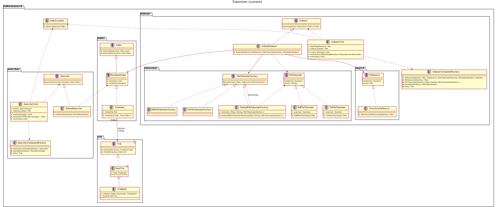

# Tarea corta #6 #

Curso IC-6821 Diseño de software  
Profesor Diego Munguía Molina

## Objetivos ##

* Aplicar el principio de inversión de dependencias en un ejercicio práctico

## Guía de trabajo ##

Finalizamos el trabajo en la implementación de la aplicación de búsqueda en archivos de texto 
especificada en [STORIES.md](./STORIES.md).

Recordamos las responsabilidades identificadas:

1. Indexar un directorio  
    a. Recorrer la fuente de datos (directorio) archivo por archivo  
    b. Procesar archivo de texto recorriendo su contenido palabra por palabra  
    c. Asociar una palabra con la ruta absoluta al archivo en el índice  
    d. Reportar en pantalla cuál directorio está siendo procesado  
2. Buscar archivos por términos  
    a. Buscar archivos en el índice por un término específico  
    b. Consolidar resultados para cada término en un conjunto final  
    c. Reportar resultados en pantalla
   
En este punto ya hemos implementado todas estas responsabilidades de la siguiente manera:

- `IndexerCmd` (1)
    + módulo `source` (1.a)
    + módulo `tokenizer` (1.b)
    + `Indexer` y módulo `index` (1.c)
    + `Consumer<File>` que se inyecta a `Indexer.index()` (1.d)
- `SearcherCmd` (2)
    + módulo `index` (2.a)
    + `Searcher` (2.b)
    + `SearcherCmd` (2.c)

Para esta tarea corta, y para completar el proyecto, nos vamos a concentrar en instanciar correctamente todos los 
componentes de las aplicaciones. 

Debemos resolver la siguiente tarea.

### Tarea 1 ###

Respetando el principio de inversión de dependencias hemos diseñado todas las implementaciones para que reciban sus 
dependencias como parámetros en los correspondientes constructores. De esta forma nos aseguramos que ninguna 
implementación conozca directamente los detalles de implementación de los otros componentes, y trabajen únicamente a 
través de las correspondientes interfaces.

Lo único pendiente de implementar entonces es la clase encargada de instanciar los componentes y aplicar la inyección de 
dependencias entre ellos. Llamaremos a esta clase con el sufijo `ComponentFactory`.

Puesto que tenemos dos ejecutables `IndexerCmd` y `SearcherCmd` y cada uno tiene dependencias diferentes, debemos 
construir entonces dos clases para inyección de dependencias: `indexer.IndexerComponentFactory` y 
`searcher.SearcherComponentFactory`.

## Aspectos operativos ##

- No modificar ningún archivo de código ya existente en el repositorio.
- No modificar ninguna prueba automatizada.
- No modificar ningún chequeo de estilo. 
- No utilizar spanglish.
- Escribir código limpio.
- Las pruebas de código verifican todos los requerimientos funcionales.
- Como entrega se considera el último `push` de código al repositorio antes de la revisión del trabajo.
- Puede encontrar información sobre cómo corregir problemas identificados por los chequeos de estilo en el siguiente 
  enlace: https://checkstyle.sourceforge.io/checks.html 

## Rúbrica ##

#### Total 10 pts #### 

#### Entrega (2 pts) ####
- (2 pts) El historial del repositorio contiene commits significativos de la persona estudiante.
- (0 pts) El historial del repositorio no contiene commits significativos de la persona estudiante. Si no hay commits 
  significativos, el resto de criterios no serán aplicados.

#### Chequeo de estilo (2 pts) ####
- (2 pts) El código en el repositorio pasa todos los chequeos de estilo.
- (0 pts) El código en el repositorio no pasa todos los chequeos de estilo.

#### Chequeo de diseño (3 pts) ####
- (3 pts) El código en el repositorio pasa todos los chequeos de diseño.
- (1 pts) El código en el repositorio pasa la mayoría de los chequeos de diseño.
- (0 pts) El código en el repositorio no pasa los chequeos de diseño.

#### Pruebas de código (3 pts)
- (3 pts) El código en el repositorio pasa todas las pruebas de código.
- (1 pts) El código en el repositorio pasa la mayoría de las pruebas de código.
- (0 pts) El código en el repositorio no pasa las pruebas de código.

